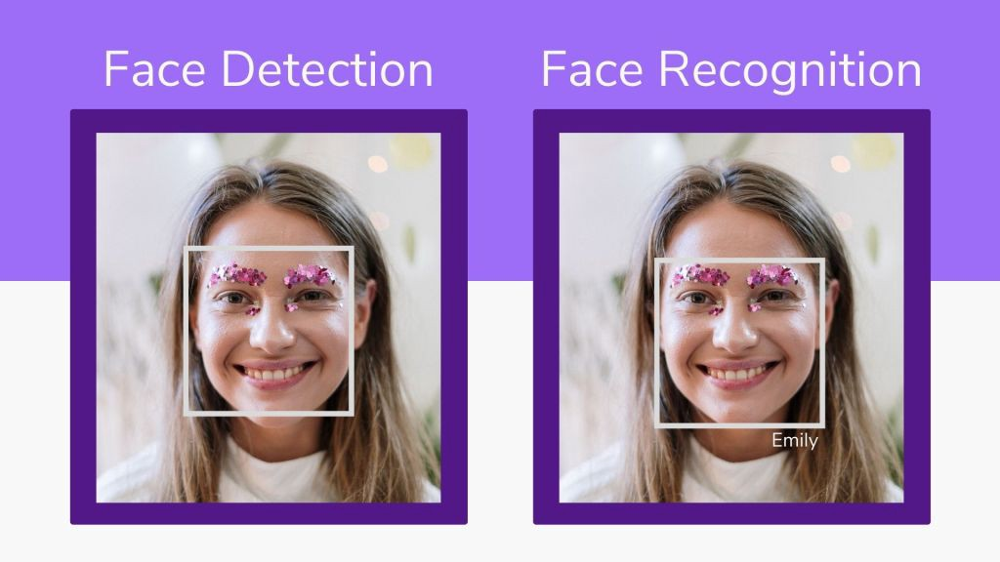

## Face Detection

Building a program that detects faces is a great way to get started with machine learning computer vision tasks. I write a program for the task of face detection with Python. When I say a program you can understand it like teaching a machine what to do. I like to use teaching rather than programming because that’s actually what I’m doing here.

The best way to learn about everything is to teach, so while teaching a machine to detect faces, we are also learning. So, before I start this face detection task with Python, I want to share the difference between face detection and face recognition.

### Face Detection Vs Face Recognition

<p align="center">
 
</p>

Face detection and face recognition may look very similar, but in reality, they are not the same. Let’s understand the difference so as not to miss the point.

Face detection is the process of detecting faces, from an image or a video does not matter. The program does nothing more than finding the faces. But on the other hand in the task of face recognition, the program finds faces and can also tell which face belongs to which. So it’s more informative than just detecting them. There is more programming, in other words, more training in the process.

Let’s say you are looking at the street and the cars are passing. Face detection is like saying the passing object is a car. And facial recognition is like being able to tell the model of the passing car. Here is a nice picture showing the difference in practice.

### Face Detection with Python

I use the `OpenCV` library in Python which is used as the primary tool for the tasks of computer vision in Python. If you are new to `OpenCV` then this task is the best to start with it.

First you need to install the OpenCV library in Python which can be easily installed by using the pip command;

```py
pip install opencv-python
```

`OpenCV` library in python is blessed with many pre-trained classifiers for face, eyes, smile, etc. These XML files are stored in a folder. We will use the face detection model. You can download the pre-trained face detection model from [here](https://raw.githubusercontent.com/opencv/opencv/master/data/haarcascades/haarcascade_frontalface_default.xml).

The next step is to choose an image on which you want to test your code. Make sure there is at least one face in the image so that the face detection program can find at least one face.

### Summary

So this is how we can easily detect a face or as many as faces in the image.