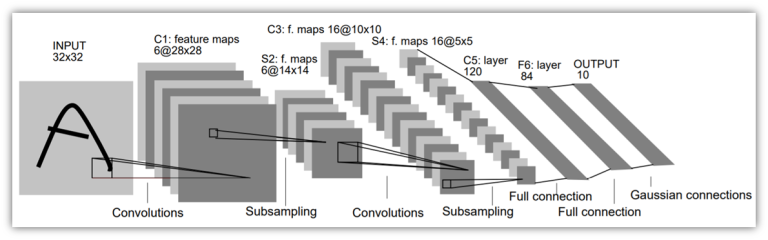

## LeNet-5 Architecture

The LeNet-5 architecture is the most widely used [architecture of convolutional neural networks](https://thecleverprogrammer.com/2020/11/05/cnn-architectures-in-machine-learning/). It was created by Yann LeCunn in 1998. If you have never used the LeNet-5 architecture of convolutional neural networks, then this project is for you.

LeNet-5 is a convolutional neural network architecture that was created by Yann LeCunn in 1998. It includes 7 layers, excluding the input layer, which contains the trainable parameters called weights. You can get a complete overview of the layers of this convolutional neural network architecture from the image below.

<p align="center">
 
</p>

In the neural network architecture shown above:
 1. Layer C1 is a convolutional layer with six feature maps where the size of the feature maps is 28×28;
 2. Layer S2 is a sub-sampling layer with six feature maps where the size of the feature maps is 14×14;
 3. Layer C3 is a convolutional layer with sixteen feature maps where the size of the feature maps is 10×10;
 4. Layer S4 is s sub-sampling layer with sixteen feature maps where the size of feature maps is 5×5;
 5. Layer C5 is a convolutional layer with 120 feature maps where the size of the feature maps is 1×1;
 6. Layer F6 contains 84 units and is fully connected to the C5 convolutional layer.

### LeNet-5 using Python

To build the LeNet-5 convolutional neural network architecture, you can use `TensorFlow` and the `Keras` library in Python.

You can also visualize the architecture of your neural network by using the `VisualKeras` library in Python. If you have never used it before, then you can install it by using the pip command mentioned below.

```py
pip install visualkeras
```

### Summary

So this is how you can build the LeNet-5 architecture of convolutional neural networks. It is an architecture of convolutional neural networks that was created by Yann LeCunn in 1998. It comprises 7 layers, excluding the input layer, which contains the trainable parameters known as weights.