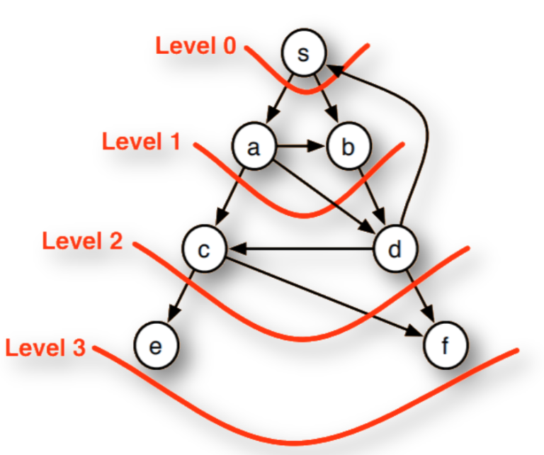

## Breadth-First Search Algorithm

The Breadth-first search algorithm is a graph algorithm which is used to traverse a graph to find a particular node to ensure that we have visited all the nodes by crossing a layer at each step. In this project, I will introduce you to the Breadth-First Search algorithm using Python.

Breadth-First Search is a graph search algorithm that can be used to solve a variety of problems such as:
 1. finding all the vertices reachable from a vertex
 2. finding if an undirected graph is connected
 3. finding the shortest path from one vertex to all other vertices
 4. to determine if a graph is bipartite
 5. to bond the diameter of an undirected graph
 6. partitioning the graph

Breadth-first search can be applied to both directed and undirected graphs. It starts at the source vertex (s) and begins to explore the graph outward in all directions level by level. In the process, it first visits all the neighbouring vertices of `s`, then it visits the vertices that have a distance of two of `s`, then a distance of three and so on.

The above process is depicted in the image below. The image below shows how the Breadth-First Search visits the vertices at all levels one by one.

<p align="center">
 
</p>

### Breadth-First Search using Python

To implement the Breadth-First Search algorithm using Python, we first need to create a queue data structure which is an abstract data structure used to insert and delete data. So I will first create a Python class “Queue”.

In the code, I started by defining a Python function like “breadth_first” which accepts two parameters (graph and root). Then I am initializing the helping variables.

Then I just use a while loop to run until the queue size is greater than 0, which indicates the nodes we haven’t visited. So I just created a function to implement the BFS algorithm using Python, and the driver code where I created the dictionary of the chart which will print the results of the breadth_first function passing the graph and the root.

### Output

```
['A', 'B', 'D', 'G', 'E', 'F', 'C', 'H']
```

### Summary

The BFS algorithm can be used to calculate many other properties of a graph such as calculating distance or shortest path. This algorithm can be described as a special graph search algorithm where we can choose the whole border at each step.