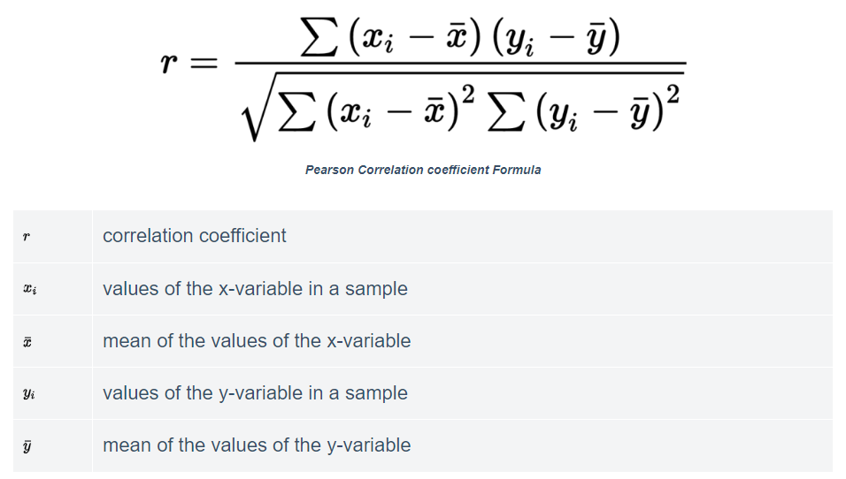

## Pearson Correlation

When two or more features are related to each other in such a way that if the value of 1 features increases, the value of the other feature also increases or decreases. This is what correlation means. In this project, I’m going to walk you through the implementation of Pearson Correlation using Python.

### What is Correlation?

Correlation means finding the relationship between variables. In data science, we use correlation to find features that are positively and negatively correlated with each other so that we can choose the best features to train a machine learning model.

The degree of correlation is between -1 and 1. When the value of the correlation between the features is 1, then those features are positively correlated with each other, and when the value of the correlation between the features is -1, it means that those features are negatively correlated to each other.

When the value of the correlation between the features is equal to 0, we can say that there is no correlation between the features. In machine learning, we can use correlation to check the relationship between all the features regarding the target label. So we can select those features to train the machine learning model which are highly correlated to the target label.

### Pearson Correlation

<p align="center">
 
</p>

Pearson correlation is a statistical technique for measuring the degree of the linear relationship between two or more features. Demand and supply are the best examples of understanding of Pearson’s correlation. For example, the supply of a product will increase when the demand for the product increases, and the supply of the product will decrease when the demand for that product increases.

Thus, according to the example above, there is a positive correlation between demand and supply of a product. Hope you now understand what correlation is and what the Pearson correlation is and why we use it before training machine learning models.

### Pearson Correlation using Python

Before we implement the Pearson correlation using Python, let’s take a look at some important points to understand the result:
 1. Positive values signify a positive linear correlation.
 2. Negative values mean negative linear correlation.
 3. 0 means no linear correlation.
 4. The closer the value is to 1 or -1, the stronger the linear correlation.

### Output

```
                 Unnamed: 0        ID      Year      IMDb  Rotten Tomatoes   Netflix      Hulu  Prime Video   Disney+   Runtime
Unnamed: 0         1.000000  1.000000 -0.254391 -0.399953        -0.201452 -0.708680 -0.219737     0.554120  0.287011 -0.206003
ID                 1.000000  1.000000 -0.254391 -0.399953        -0.201452 -0.708680 -0.219737     0.554120  0.287011 -0.206003
Year              -0.254391 -0.254391  1.000000 -0.021181        -0.057137  0.258533  0.098009    -0.253377 -0.046819  0.081984
IMDb              -0.399953 -0.399953 -0.021181  1.000000         0.616320  0.135105  0.042191    -0.163447  0.075895  0.088987
Rotten Tomatoes   -0.201452 -0.201452 -0.057137  0.616320         1.000000  0.017842  0.020373    -0.049916 -0.011805  0.003791
Netflix           -0.708680 -0.708680  0.258533  0.135105         0.017842  1.000000 -0.107911    -0.757215 -0.088927  0.099526
Hulu              -0.219737 -0.219737  0.098009  0.042191         0.020373 -0.107911  1.000000    -0.255641 -0.034317  0.033985
Prime Video        0.554120  0.554120 -0.253377 -0.163447        -0.049916 -0.757215 -0.255641     1.000000 -0.298900 -0.067378
Disney+            0.287011  0.287011 -0.046819  0.075895        -0.011805 -0.088927 -0.034317    -0.298900  1.000000 -0.019976
Runtime           -0.206003 -0.206003  0.081984  0.088987         0.003791  0.099526  0.033985    -0.067378 -0.019976  1.000000
Unnamed: 0        -0.254391
ID                -0.254391
Year               1.000000
IMDb              -0.021181
Rotten Tomatoes   -0.057137
Netflix            0.258533
Hulu               0.098009
Prime Video       -0.253377
Disney+           -0.046819
Runtime            0.081984
Name: Year, d
```

### Summary

I hope you liked this project on what is Pearson Correlation and its implementation using Python.