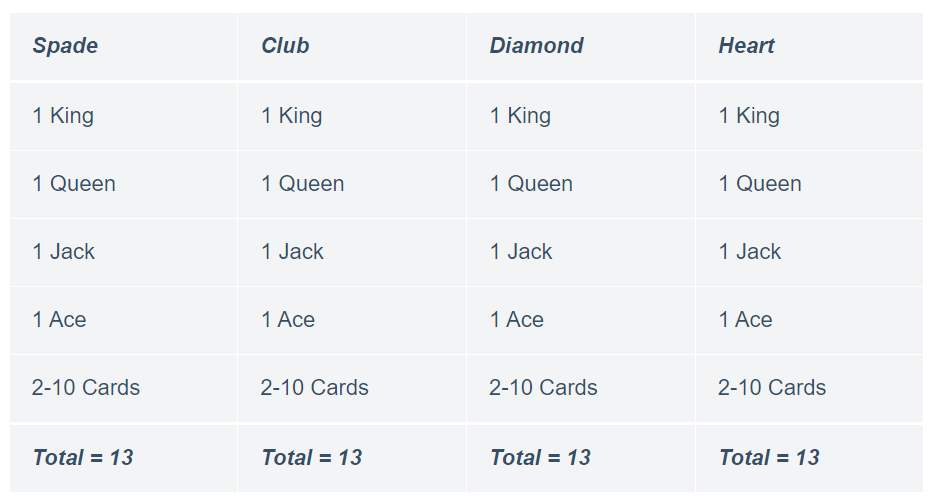

## Pick a Random Card

There are so many card games today where you choose a card at random from a deck of cards to create an event. This is the feature of every card game today because you have to choose a card at random and once you choose a card it becomes an event.

### Pick a Random Card using Python

To pick a random card using Python you first have to store all the cards in a data structure. So before storing a card in a data structure let’s understand what types of cards are there in a deck of cards. Below is a table that shows the type of cards present in a deck of cards.

<p align="center">
 
</p>

So according to the above table, a deck of cards have four sets of cards including hearts, clubs, spades and diamonds. These sets of cards are known as suites, each suite has thirteen cards which starts from 2 to 10 and then are continued with Jack, Queen, king and Ace in each suite.

So to pick a random card from a deck of cards, I will create two Python lists:
 1. one for storing the suits
 2. another for storing the ranks of cards.

### Output

```
The ['Ace'] of ['Spades']
```

### Summary

So this is how we can write a Python program to draw a random card from a deck of cards. You can also implement the same strategy for creating a complete [card game](https://thecleverprogrammer.com/2020/10/04/card-game-with-python/).