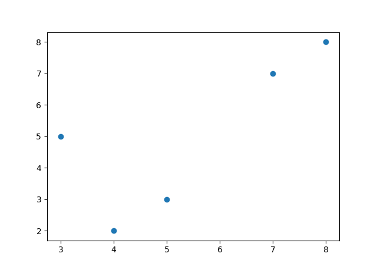

## Plot Annotations

Plotting annotations while viewing graphs is considered a good practice because it makes your graphs self-explanatory. Sometimes it can be difficult to understand which data points indicate which characteristic especially in a scatter plot.

### Plotting Annotations using Python

Plotting annotations while visualizing your data is considered good practice to make the graphs self-explanatory. Sometimes it gets very hard for us to understand what curves and dots represents which data points. In such situations using annotations is very helpful. In the Python programming language, the `matplotlib` library provides `matplotlib.pyplot.annotate` which makes it easy to annotate any type of graph.

For example, have a look at the figure below, it a not easy for everyone to understand what is this scatter plot about and what the dots of this plot indicates.

 

So in such situations, plotting annotations can help us in understanding and explaining the data points.

In the code, we plot the figure without using annotations, and annotate the graph using Python to make it self-explanatory. I will represent the data points as the monthly outcomes.

### Summary

So using annotations can help you understand and explain data visualizations very easily. [Here](https://thecleverprogrammer.com/2020/05/09/data-science-project-on-text-and-annotations/) is a complete tutorial where you can learn more about annotating graphs using Python.